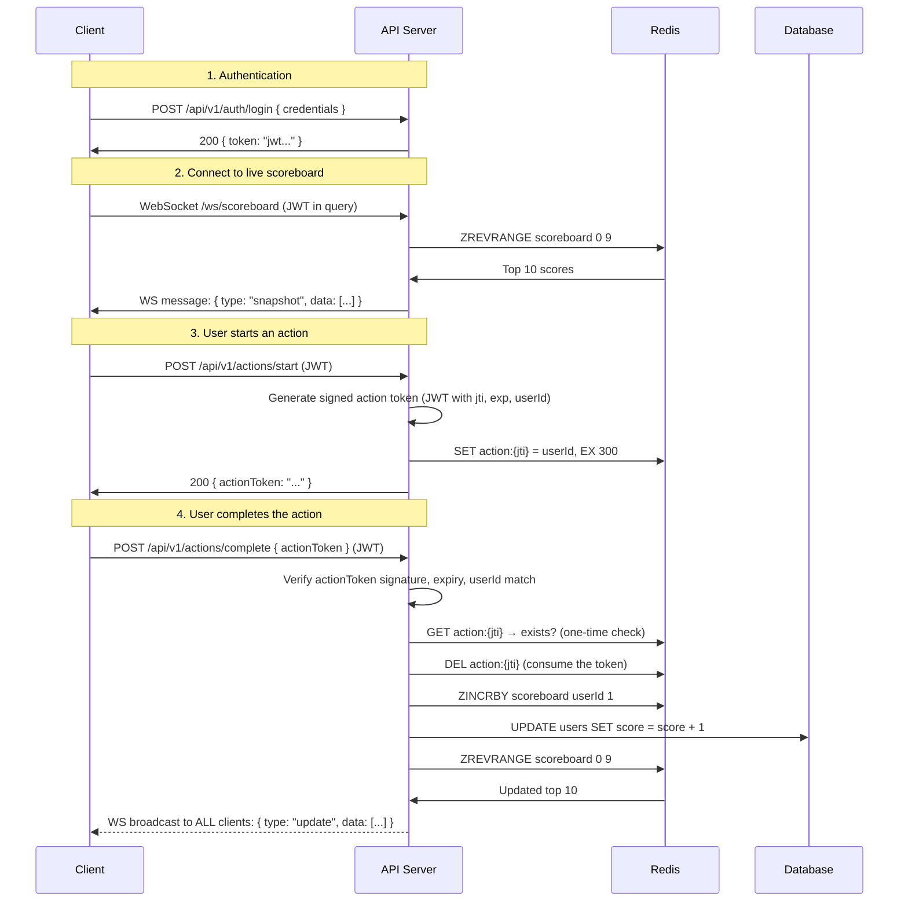

# Problem 6: Live Scoreboard Module — API Specification

## Overview

A backend module that manages a live scoreboard displaying the top 10 users by score. Users complete actions to earn points, and the scoreboard updates in real-time across all connected clients.

### Key Challenges

1. **Real-time delivery** — All clients must see scoreboard changes as they happen
2. **Anti-cheat** — Users must not be able to inflate scores by calling the API directly

## Architecture

### System Components

```
┌──────────┐       HTTPS        ┌───────────────────┐       ┌───────────┐
│  Client  │ ──────────────────▶ │   API Server      │ ────▶ │ Database  │
│ (Browser)│                     │   (Express/Nest)   │       │ (Postgres)│
│          │ ◀── WebSocket ──── │                    │       └───────────┘
└──────────┘                     │  ┌──────────────┐ │
                                 │  │ Auth Middleware│ │       ┌───────────┐
                                 │  ├──────────────┤ │ ────▶ │   Redis   │
                                 │  │ Rate Limiter  │ │       │ (Sorted   │
                                 │  ├──────────────┤ │       │    Set)   │
                                 │  │ Action Tokens │ │       └───────────┘
                                 │  └──────────────┘ │
                                 └───────────────────┘
```

**Why Redis?** A Redis sorted set (`ZADD`, `ZREVRANGE`) gives O(log N) score updates and O(log N + 10) for fetching the top 10. It also serves as a fast cache so the database isn't hit on every scoreboard request.

**Why WebSocket?** Server-Sent Events (SSE) would also work for one-way push, but WebSocket allows future bidirectional features (e.g., challenges between users).

## Execution Flow



## API Endpoints

### Authentication

| Method | Endpoint | Description |
|--------|----------|-------------|
| `POST` | `/api/v1/auth/login` | Authenticate and receive JWT |

### Actions

| Method | Endpoint | Description |
|--------|----------|-------------|
| `POST` | `/api/v1/actions/start` | Begin an action, receive a one-time action token |
| `POST` | `/api/v1/actions/complete` | Submit completed action with token, score is updated |

### Scoreboard

| Method | Endpoint | Description |
|--------|----------|-------------|
| `GET` | `/api/v1/scoreboard` | REST fallback: fetch current top 10 |
| `WS` | `/ws/scoreboard` | Real-time: receive top 10 updates via WebSocket |

## Anti-Cheat: Action Token Flow

The core security problem: **what prevents a user from calling `POST /actions/complete` directly without actually doing the action?**

Answer: **signed, one-time-use action tokens.**

```
1. Client calls POST /actions/start
2. Server creates a short-lived JWT (action token):
   - Contains: userId, jti (unique ID), exp (5 min TTL)
   - Stores jti in Redis with TTL as a "pending action"
3. Client performs the action (we don't care what it is)
4. Client calls POST /actions/complete with the action token
5. Server verifies:
   a. Token signature is valid (not forged)
   b. Token is not expired
   c. userId in token matches the authenticated user
   d. jti exists in Redis (not already used)
6. Server deletes the jti from Redis (consumed — cannot be replayed)
7. Server increments the score
```

This ensures:
- **No forgery** — tokens are signed by the server
- **No replay** — each token can only be used once (Redis check + delete)
- **No impersonation** — userId in the action token must match the JWT
- **No stale actions** — tokens expire after 5 minutes

## Data Models

### User (PostgreSQL)

```sql
CREATE TABLE users (
    id         SERIAL PRIMARY KEY,
    username   VARCHAR(50) UNIQUE NOT NULL,
    score      INTEGER NOT NULL DEFAULT 0,
    created_at TIMESTAMPTZ NOT NULL DEFAULT NOW(),
    updated_at TIMESTAMPTZ NOT NULL DEFAULT NOW()
);

CREATE INDEX idx_users_score ON users (score DESC);
```

### Redis Keys

| Key | Type | TTL | Purpose |
|-----|------|-----|---------|
| `scoreboard` | Sorted Set | — | Live leaderboard: member = userId, score = points |
| `action:{jti}` | String | 300s | Pending action token (value = userId) |

## Request / Response Examples

### POST /api/v1/actions/start

```
Headers: Authorization: Bearer <jwt>

→ 200 OK
{
  "data": {
    "actionToken": "eyJhbG...",
    "expiresIn": 300
  }
}
```

### POST /api/v1/actions/complete

```
Headers: Authorization: Bearer <jwt>
Body: { "actionToken": "eyJhbG..." }

→ 200 OK
{
  "data": {
    "userId": 42,
    "newScore": 1580,
    "scoreboardPosition": 3
  }
}

→ 400 Bad Request (token already used)
{
  "error": {
    "code": "INVALID_ACTION_TOKEN",
    "message": "Action token has already been used or expired"
  }
}
```

### WebSocket /ws/scoreboard

```
// On connect → server sends current snapshot
{ "type": "snapshot", "data": [
    { "userId": 1, "username": "alice", "score": 2500 },
    { "userId": 7, "username": "bob",   "score": 2340 },
    ...
]}

// On score change → server pushes update to all clients
{ "type": "update", "data": [ ... top 10 ... ] }
```

## Rate Limiting

Even with action tokens, apply rate limits as defense-in-depth:

| Endpoint | Limit | Window |
|----------|-------|--------|
| `POST /actions/start` | 30 requests | per minute per user |
| `POST /actions/complete` | 30 requests | per minute per user |
| `GET /scoreboard` | 60 requests | per minute per IP |

## Suggestions for Improvement

### 1. Debounce WebSocket broadcasts

If many users complete actions simultaneously, broadcasting on every single score change creates a flood. Instead, **batch updates** — collect changes and broadcast at most once every 500ms–1s.

```
Score change → add to pending queue
Every 500ms → if queue not empty, broadcast once and flush
```

### 2. Action-specific validation (if possible)

The current design trusts that the client actually performed the action between `start` and `complete`. If the action has server-observable outcomes (e.g., a quiz answer, a game move), the server should **verify the result** rather than just checking the token.

### 3. Anomaly detection

Track scoring patterns per user. Flag accounts that:
- Score faster than the 99th percentile of legitimate users
- Complete actions faster than humanly possible (e.g., < 100ms between start and complete)
- Spike in activity at unusual hours

This can be done asynchronously (a background job processing an event log) without adding latency to the main flow.

### 4. Event sourcing for auditability

Instead of just incrementing a score counter, store each action completion as an event:

```sql
CREATE TABLE score_events (
    id         SERIAL PRIMARY KEY,
    user_id    INTEGER NOT NULL REFERENCES users(id),
    action_id  VARCHAR(50) NOT NULL,  -- the jti
    points     INTEGER NOT NULL DEFAULT 1,
    created_at TIMESTAMPTZ NOT NULL DEFAULT NOW()
);
```

This enables: auditing, rolling back fraudulent scores, analytics on action completion rates, and debugging disputed scores.

### 5. Horizontal scaling

If the service needs to scale across multiple server instances:
- Redis Pub/Sub (or a message broker like NATS) to fan out WebSocket broadcasts across instances
- Sticky sessions or a shared adapter (e.g., `socket.io-redis`) for WebSocket connections
- The Redis sorted set naturally serves as shared state
